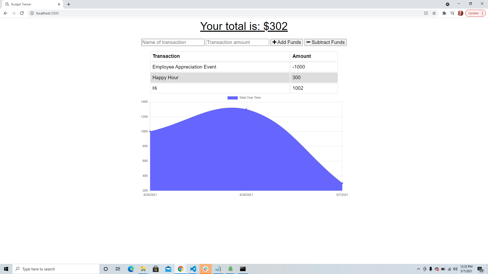

# Progressive Budget Tracker

***An Online/Offline Budget Tracker Tool***

[Click here to get started.](https://business-budget-tracker-app.herokuapp.com/)

## User Story

AS AN avid traveller
I WANT to be able to track my withdrawals and deposits with or without a data/internet connection
SO THAT my account balance is accurate when I am traveling.

## Functionality

The user will be able to add expenses and deposits to their budget with or without a connection. When entering transactions offline, they should populate the total when brought back online.

Offline Functionality:

* Enter deposits offline
* Enter expenses offline

When brought back online:

* Offline entries should be added to tracker.

## Business Context

Giving users a fast and easy way to track their money is important, but allowing them to access that information anytime is even more important. Having offline functionality is paramount to our applications success.

## User Demo

## Future Development

* Add different coding categories to assist in a cleaner P&L format.
* Adding date and time specific spending.
* Add a feature to link it to different users.

## Resources

[Heroku & MongoDB Documentation](https://developer.mongodb.com/how-to/use-atlas-on-heroku/)

[MongoDB Documentation](https://docs.mongodb.com/)

## Contact

[Github](https://github.com/ilyublinsky)

EMAIL ME:

> ingrid.lyub@gmail.com
